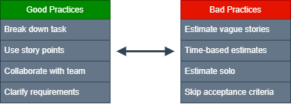
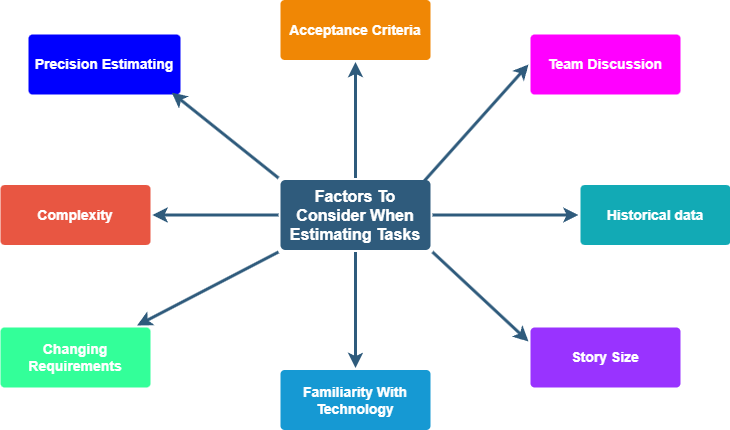

# Task Estimation in Scrum

Task estimation is a vital part of Scrum, helping teams plan sprints, forecast delivery, and manage stakeholders' expectations. In this section of the handbook, we will dive into the standard guidelines of task estimation in scrum, highlighting common challenges with estimation and strategies to mitigate these while also laying out good and bad practices, using real-world experiences of developers and scrum team members. The aim is to give your team a better understanding of the right practices at the company in an easy-to-understand format to help you better grasp the common themes of task estimation in Scrum.

## Good Practices

### Break Down Large Tasks

Large or vague tasks can be difficult to estimate accurately.  
To improve clarity and estimation:

- Break down large tasks into **smaller, more manageable subtasks**.
- Ensure each subtask has a clear goal and can be estimated individually.

### Relative Sizing

It can be difficult to estimate tasks precisely.  
To improve clarity and estimation:

- Use relative sizing estimate task compared to **baseline or reference task**.
- Many teams use the Fibonacci sequence as a good reference (1, 2, 3, 5, 8, 13).
- A **3-point** story might be something that one or two people can complete with little uncertainty, while an **8-point** story usually carries more unknowns or risk.

### Involve The Whole Team

Task estimation is a collaborative effort.
When the entire team is involved in the estimation process:

- Foster collaboration, commitment, and accountability.
- Leverage team members' experience and insights for more accurate task estimation.

### Re-estimate When Needed

Some teams worry that re-estimating mid-sprint means failure, but it's actually a sign of agility. 

- Unexpected complexity or shifting priorities are normal, the goal is to adapt and keep sprint goals realistic.
- Estimation is not a contract its and iterative process, keep it flexible.

  
## Bad Practices

### Time as an Estimation

Using time solely as an estimation.
Leading to:

- Someone may misunderstand time estimates as commitments rather than approximations.
- Focusing on time can lead to underestimating the complexity or risks involved in a task.
- Time-based estimates often fail to reflect real progress.

### Trying to be too Precise

Attempting to make estimations overly accurate often leads to wasted time or false confidence. 

- The purpose of estimation isn't precision. You'll go too big sometimes and too small on other occasions; it all evens out over time.
- Spending time debating what number to give a story point is rarely productive
- Teams should focus on consistency over time, not one-time accuracy

### Insufficient Acceptance Criteria

If the acceptance criteria don't contain vital information, estimation is tough.

- If you don't know what the current behaviour is, it's going to be tricky to estimate the story size.
- Get your scrum master/analysts to clarify before you accept the story.

*Comparison of good vs bad estimation practices*

## Common Themes

From our research of developers' experiences with time estimations in scrum, here are some common themes and insights we found.

- **Time does not equal effort!:** Time-based estimates often backfire; story points are much more reliable when it comes to estimation and help keep things realistic.
- **Accurate estimation comes from discussion:** The team conversations during estimation uncover risks and insights, which are more valuable than numbers.
- **Anchoring bias or Group-Think:** When a senior dev or individual gives a estimate first others tend to follow without challenge.
- **Historical data improves estimates:** Teams improve their estimation over time, learning from past experiences such as the actual effort, time, and quality of each task. Don't expect perfection in the early sprints.
- **Open communication is key:** Lack of familiarity with technology or uncertainty and risk associated with a task all play a factor in task estimation. Maintaining open communication and transparency within the team is crucial for addressing potential challenges and fostering a supportive team environment, enhancing overall project planning and execution.
  
*Mind map of factors that influence task estimation*

## Key Takeaways

- Estimate effort, not time.
- Break down large tasks to improve accuracy.
- Involve the entire team for better estimation.
- Avoid over-precision, aim for consistent estimates.
- Use story points, not hours.

## Further Reading 

- *Task Estimation with Scrum* https://www.projectmanagement.com/blog-post/46054/task-estimation-with-scrum

- *The Risks Of Estimating Time As An Agile Team, And What To Do About It* https://medium.com/serious-scrum/the-risks-of-estimating-time-as-an-agile-team-and-what-to-do-about-it-f31623f6c3a6

- *How can you ensure accurate task estimation in Scrum teams?* https://www.linkedin.com/advice/0/how-can-you-ensure-accurate-task-estimation-pcire

- *When to add tasks to stories and how to estimate tasks?* https://pm.stackexchange.com/questions/11073/when-to-add-tasks-to-stories-and-how-to-estimate-tasks

- *Stories and task estimation* https://www.reddit.com/r/scrum/comments/18bbr88/stories_and_task_estimation/

